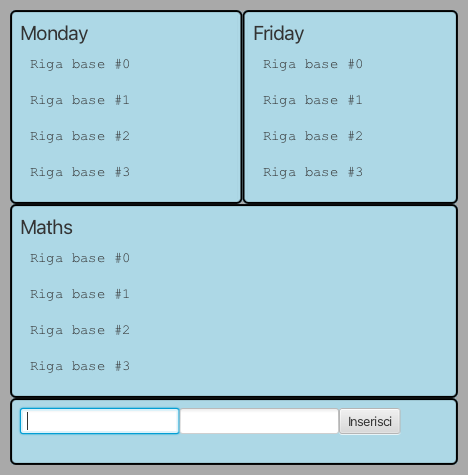
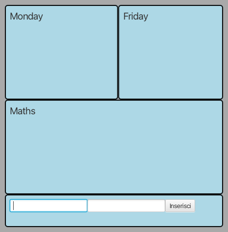
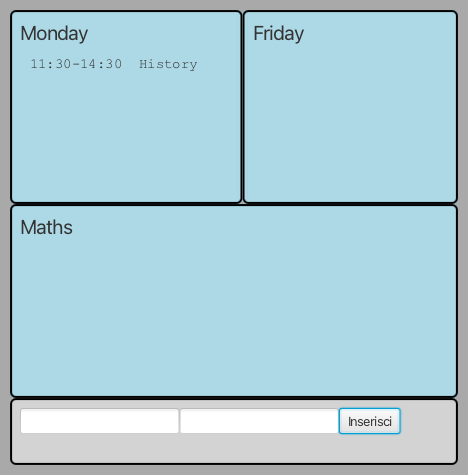
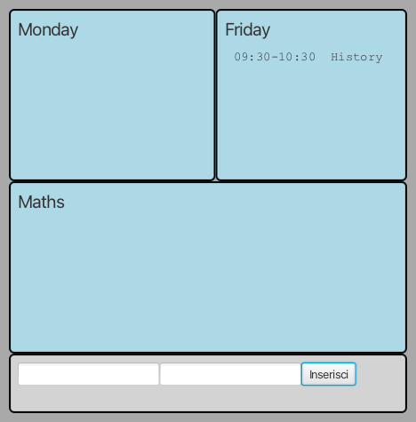
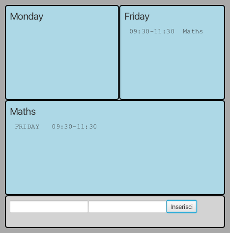
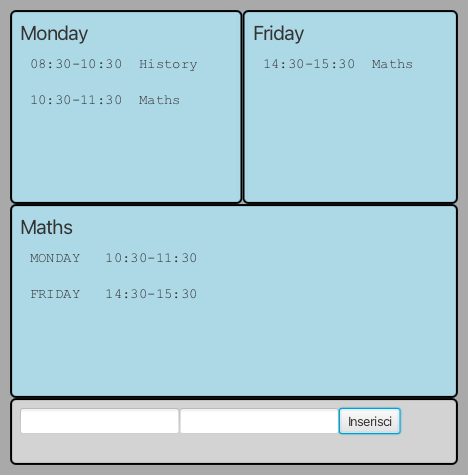
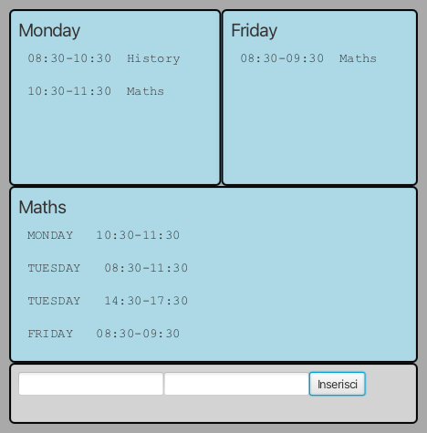
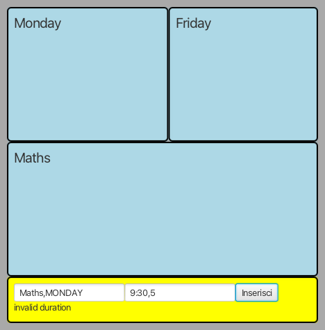
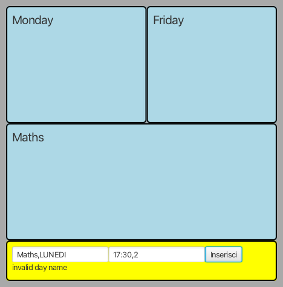

# CORSO INGEGNERIA DEL SOFTWARE A.A. 2025/26

## Laboratorio 10

Ogni studente effettua il **fork** di questo repository e
concede i **permessi di lettura** ai docenti (`carlo.bellettini` e `mattia.monga`).

### Orario scolastico

Con l'inizio dell'anno scolastico è necessario raccogliere gli avvisi che annunciano gli orari di svolgimento delle lezioni. Occorre quindi realizzare un sistema che permetta di registrare gli avvisi e visualizzare l'orario nel suo complesso.

Vengono già fornite due *Viste*:

- [`InputLezione`](src/main/java/it/unimi/di/sweng/esame/view/InputLezione.java): mette a disposizione due caselle di testo
  per immettere i dati di una lezione (primo campo con l'indicazione della materia e del giorno della settimana) e del relativo orario (secondo campo con l'indicazione dell'ora di inizio e la durata in ore).
- [`DisplayView`](src/main/java/it/unimi/di/sweng/esame/view/DisplayView.java): permette di visualizzare un elenco di righe di testo.

Viene fornita anche una prima versione della classe  [`Main`](src/main/java/it/unimi/di/sweng/esame/Main.java) che
permette d'istanziare la parte statica delle viste, e di una
interfaccia [`InputPresenter`](src/main/java/it/unimi/di/sweng/esame/presenter/InputPresenter.java).

**TUTTE LE CLASSI DATE POSSONO ESSERE DA VOI MODIFICATE (CANCELLATE, COMPLETATE) PER ADERIRE A VOSTRE IDEE DI
PROGETTAZIONE**

Lanciando il programma (tramite il task `run` di gradle) si ottiene una interfaccia simile a quella nella figura
sottostante.

## TRACCIA

Completare, in modo da realizzare un'organizzazione del sistema di tipo
*Model-View-Presenter*, aggiungendo le classi necessarie affinché:

- La vista di input che permetta
    - l'immissione di materia e giorno di erogazione  separati da `,`  (p.es. `Maths,MONDAY`).
    - l'immissione dell'ora di inizio  (ora 24h e minuti separati da `:`) e la durata in ore  separati da `,`   (p.es. `8:30,2`).
- Una vista riporti l'elenco delle prime 4 lezioni del lunedì (MONDAY), in ordine crescente di orario di inizio.
- Una vista riporti l'elenco delle prime 4 lezioni del venerdì (FRIDAY), in ordine crescente di orario di inizio.
- Una vista riporti l'elenco delle prime 4 lezioni di matematica (Maths), con giorno e orario, in ordine crescente di giorno e di orario di inizio.

Le lezioni non possono sovrapporsi: nel caso si tenti l'immissione di una lezione sovrapposta a una già registrata, il sistema deve segnalare un errore. 
Le lezioni non possono iniziare prima delle 8:30 e non possono terminare dopo le 18:30.

Dovranno inoltre essere segnalati anche i seguenti errori (di alcuni c'è anche la dizione attesa scritta nei test di integrazione forniti):

- nomi di giornate scorrette (si usa la parola inglese e le lezioni si svolgono dal lunedì al venerdì)
- orari di inizio non validi (ore non comprese tra 8:30 e 18:30)
- durate non conformi (numeri interi non compresi tra 1 e 4 ore -- inclusi --)

### Esempi di esecuzione

Alla partenza ci dovremo trovare nella seguente situazione ripulita:

Dopo aver inserito una lezione di storia di 3 ore il lunedì alle 11:30:

Dopo aver inserito una lezione di storia di 1 ora il venerdì alle 9:30:

Dopo aver inserito una lezione di matematica di 2 ore il venerdì alle 9:30:

Dopo aver inserito una lezione di matematica di 1 ora il lunedì alle 10:30, una lezione di storia di 2 ore il lunedì alle 8:30 e una lezione di matematica di 1 ora il venerdì alle 14:30:

Dopo aver inserito una lezione di matematica di 1 ora il lunedì alle 10:30, una lezione di storia di 2 ore il lunedì alle 8:30, una lezione di matematica di 1 ora il venerdì alle 8:30, una lezione di matematica di 3 ore il martedì alle 14:30, una lezione di matematica di 3 ore il martedì alle 8:30:

### Gestione input errati (gestite tutti gli errori che ritenete significativi)

L'inserimento di una durata negativa, produce un messaggio di errore:

L'inserimento di una durata maggiore di 4, produce un messaggio di errore:

L'inserimento di un orario di inizio anteriore alle 8:30, produce un messaggio di errore:

L'inserimento di un orario di inizio che induce una fine dopo le 18:30, produce un messaggio di errore:

L'inserimento di un giorno della settimana sbagliato, produce un messaggio di errore:

L'inserimento di un orario non conforme, produce un messaggio di errore:

### Processo

Una volta effettuato il **clone** del repository, lo studente completa l'implementazione seguendo la *metodologia TDD*;
in maggior dettaglio, ripete i passi seguenti fino ad aver implementato tutte le funzionalità richieste:

* scelta la prossima funzionalità richiesta da implementare, inizia una feature di gitflow
* implementa un test per la funzionalità,
* verifica che **il codice compili correttamente**, ma l'**esecuzione del test fallisca**; solo a questo punto effettua
  un *commit*
  (usando `IntelliJ` o `git add` e `git commit`) iniziando il messaggio di commit con la stringa `ROSSO:`,
* aggiunge la minima implementazione necessaria a realizzare la funzionalità, in modo che **il test esegua con
  successo**; solo a questo punto
  effettua un *commit* (usando `IntelliJ` o `git add` e `git commit`) iniziando il messaggio di commit con la
  stringa `VERDE:`,
* procede, se necessario, al **refactoring** del codice, accertandosi che le modifiche non
  comportino il fallimento di alcun test; solo in questo caso fa seguire a ogni
  passo un *commit* (usando `IntelliJ` o `git add` e `git commit`)
  iniziando il messaggio di commit con la stringa `REFACTORING:`,
* ripete i passi precedenti fino a quando non considera la funzionalità realizzata nel suo complesso e allora chiude la
  feature di gitflow

### Testing

Mano a mano che si sviluppa il progetto, si deve controllare che, tramite i test di unità, si riesca a mantenere una 
copertura, sia dei comandi che delle decisioni, soddisfacente (se inferiore al 100% inserire un commento che spieghi 
perché non è possibile raggiungerlo).

Sono presenti anche alcuni test di integrazione (inizialmente marcati come `@Disabled`), li potete riabilitare mano 
a mano che avete i componenti necessari e ne volete testare la integrazione. **Potete anche aggiungerne altri** se 
vi servono per 
verificare correttezza del vostro codice dedicato a configurare e collegare (integrare appunto) i vari componenti.

### RELEASE

Durante lo sviluppo avete alcune release da fare (con gitflow e da pushare su gitlab):

- prima release quando per la prima volta chiuderete una feature dopo le 16:30
- ultima release quando consegnate **PRIMA** dell'orario comunicato di consegna.

Ogni volta che fate una release (tranne ultima consegna non dovreste avere feature aperte) dovete effettuare un *push* dei passi svolti su `gitlab.di.unimi.it`:
 - `git push --all` e `git push --tags`.

Al termine del laboratorio impacchettate l'ultima versione stabile come una
release di gitflow chiamata "**CONSEGNA**" comprendente tutte le feature completate ,
poi effettuate un ultimo *push* (`git push --all`) anche di tutti i rami locali (comprese eventuali
feature aperte ma non completate). Ricordate di fare push anche dei tag (`git
push --tags`). 

